# Jumper tutorial

## Stel een Unity project op

1. Start Unity Hub, maak een 3D-project en noem het Jumper.
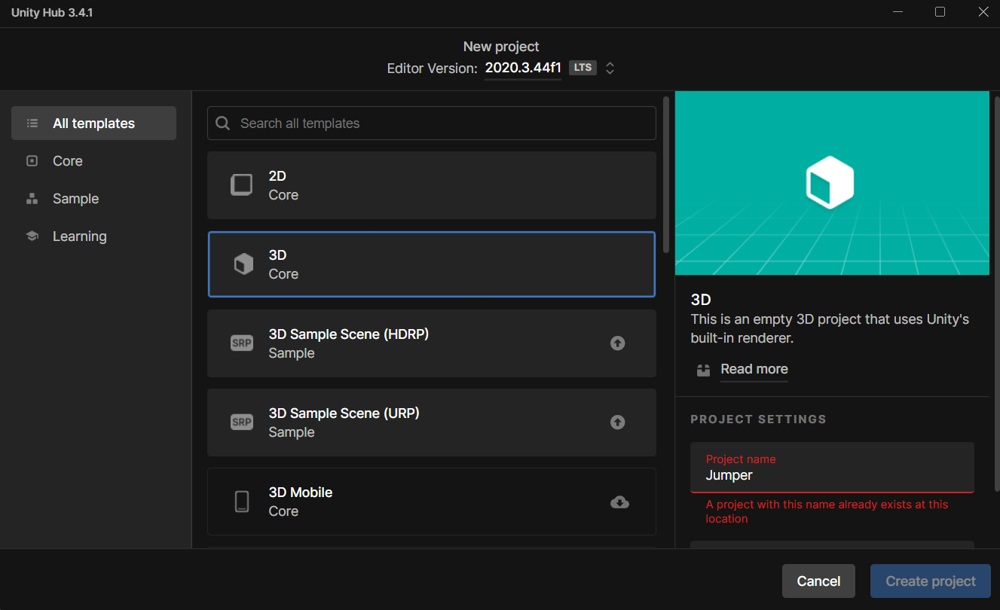
2. Voeg het ML-Agent pakket toe in uw package manager. Zorg ervoor dat het de nieuwste versie is om problemen te vermijden.
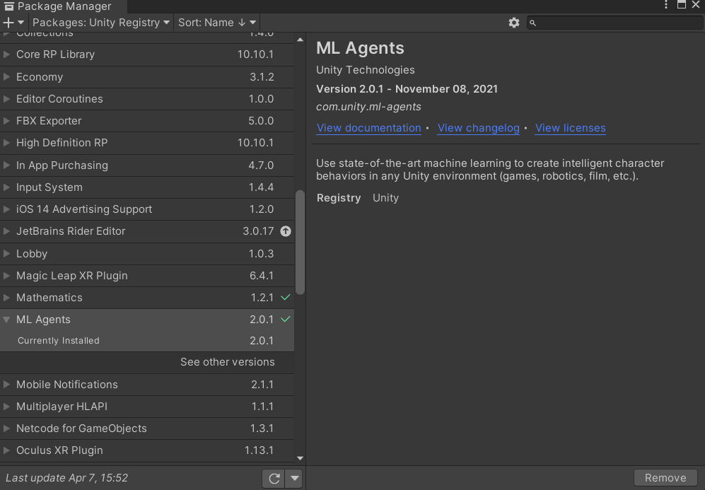

## Stel je scene op

Zorg ervoor dat het een plane bevat dat zal fungeren als onze vloer, een kubus die onze agent zal zijn, een kubus die ons obstakel zal zijn, een andere kubus die zal dienen als een bonus en een muur die het obstakel ende bonus zal verwijderen als ze botsen en als laatst een spawner die de Bonus en Obstacle instantiëert. De vloer mag je Floor noemen, uw agent-kubus noem je Agent, de bonus heet Bonus, de obstakel noem je Obstacle, de spawner noem je ObstacleSpawner.

## Probeer de properties van de illustraties van de inspector voor je objecten na te bootsen, uiteraard is de material optioneel:
### De Floor opstellen

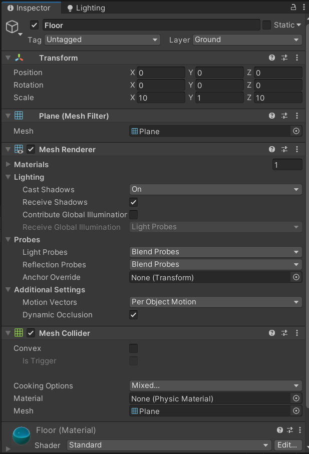

### Maak uw Agent

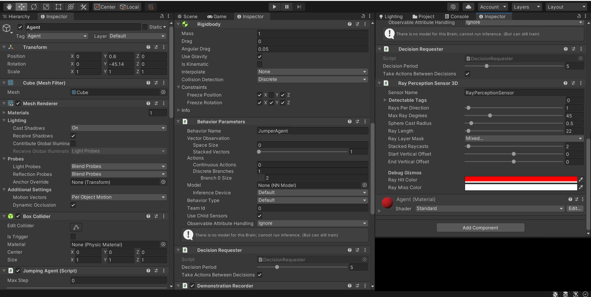

### Creëer je Obstacle

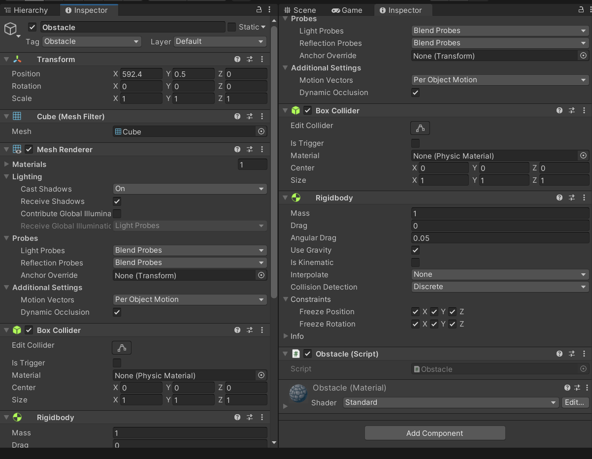

### Maak de Wall

Hiervoor hebben we er twee voor nodig: Wall en Wall2
#### Wall:
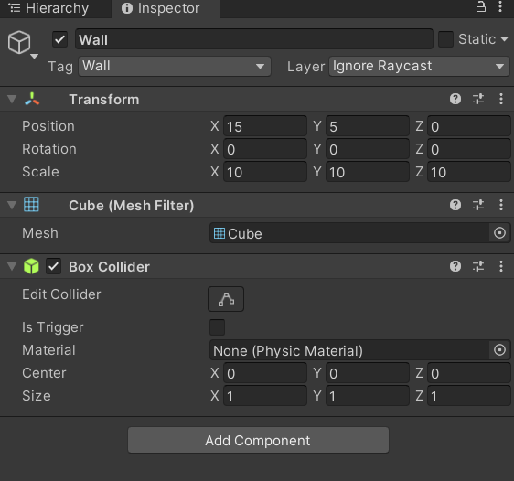

#### Wall2:
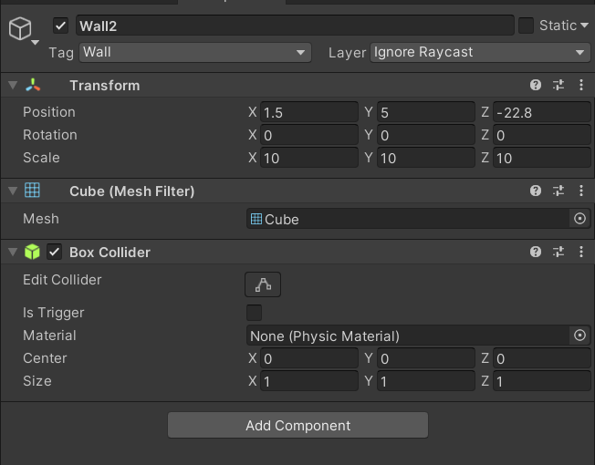

### Stel je Bonus op

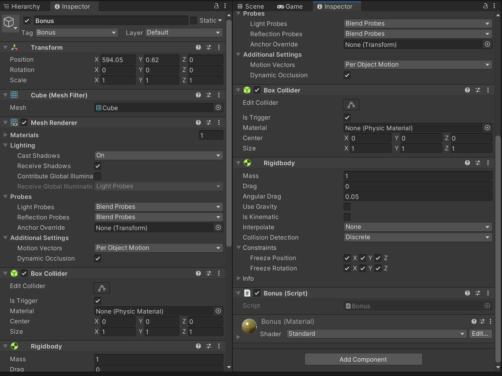

### Stel je ObstacleSpawner op

Hiervoor hebben we er twee voor nodig: ObstacleSpawner en ObstacleSpawner2
#### ObstacleSpawner:
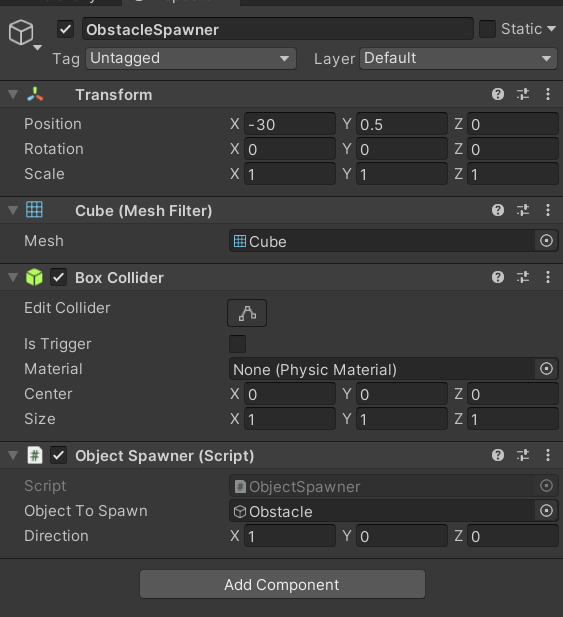

#### ObstacleSpawner2:

Steek al deze objecten nadien in een empty object in de Hierarchy en noem het TrainingArea. Uiteraard kan je naar je eigen wil ook de positie en rotatie van je main camera aanpassen zodat het goed staat.

### (optioneel) Verfraai je scene

Als je het wilt, kun je net zoals ik je scene verfraaien met straatjes, een kruispunt en wat borden. Je kunt deze stappen ondernemen om hetzelfde te krijgen:
1. Windows > Asset Store > Search online
2. Zoek naar het package LowPolyStreetPack
3. Download het en importeer het in je game.
4. Plaats Road_Cross_A_A in het midden van je Floor, een klein beetje hoger en maak zijn layer Ground.

## Stel je .yaml bestand in

1. Rechtermuisknop > create > Folder. Noem het config.
2. Open visual studio code en ga naar de config folder en maak een nieuwe file JumperAgent.yaml aan en vul de waardes in zoals in de illustratie hieronder.

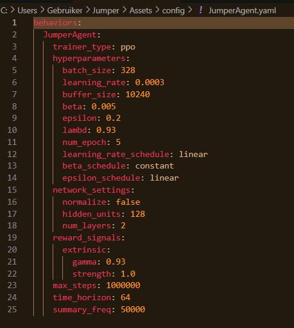

## Scripts

Om mijn applicatie te reproduceren, moet je 4 scripts hebben. Bonus, JumpingAgent, ObjectSpawner, Obstable. Hieronder vind je de code voor elke script:

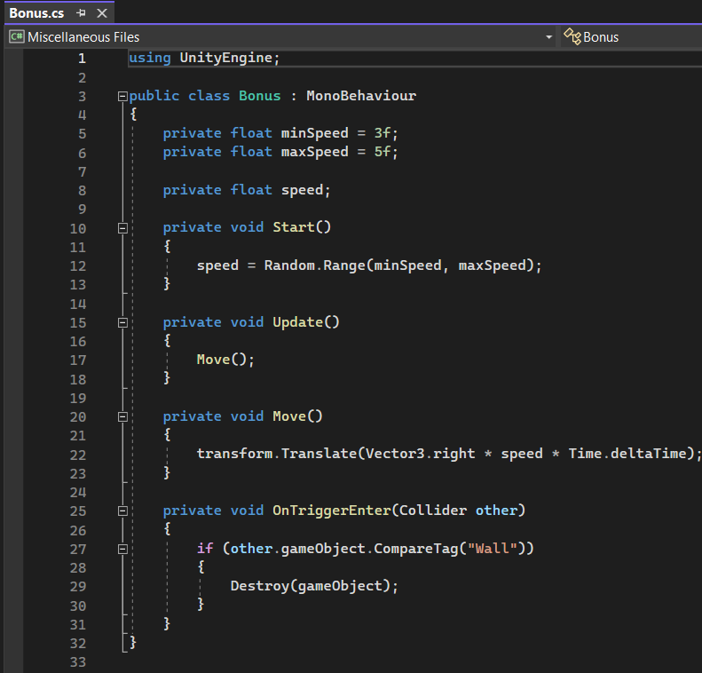
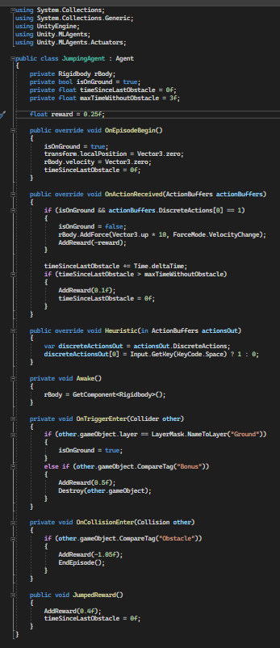
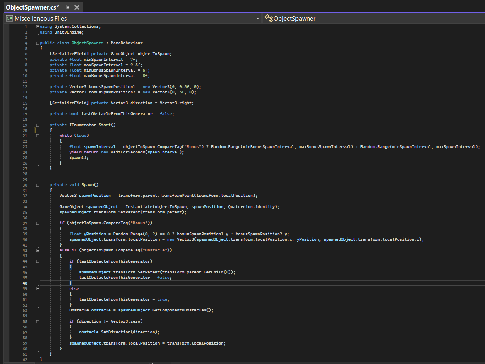
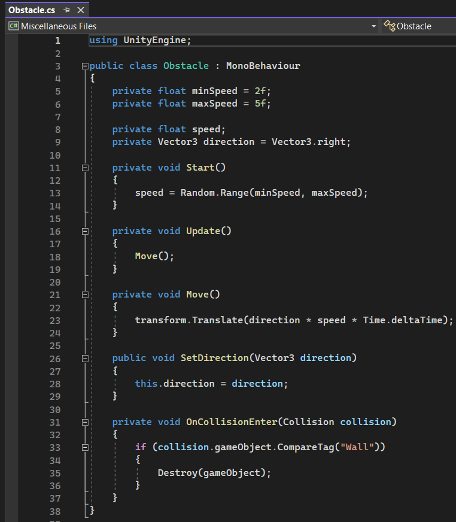   
 
Als het correct gelukt is om alles over te kopieren zou het geen errors moeten geven.

## Hoe je je agent traint

### Installatie
Om je je agent te trainen is het vereist dat je anaconda (prompt) hebt geinstalleerd. De instructie kun je volgen op anaconda.com.
1. Open Anaconda prompt en run: (enkel voor Windows) installatie PyTorch: pip3 install torch~=1.7.1 -f https://download.pytorch.org/whl/torch_stable.html
2. Installatie ML Agents: python -m pip install mlagents==0.28.0
3. Kijk na of installatie gelukt is: mlagents-learn --help

### Agent trainen

1. Open twee tabbladen van anaconda prompt en navigeer voor beiden naar je Assets map van je Unity project waar je config folder staat.
2. Run dit in één van de tabbladen: mlagents-learn config/JumperAgent.yaml --run-id=KiesJeZelf
3. Run dit in de andere tabblad: tensorboard --logdir results

Uiteraard mag je de naam van je run-id zelf verzinnen.

## Mijn Tensorboard resultaten

Hieronder vind je een illustratie van de cumulatieve beloningen weer voor het trainen van mijn Agent. Normaal gezien zou je met deze vergelijkbare hoeveelheid steps, hetzelfde resultaat moeten bekomen.

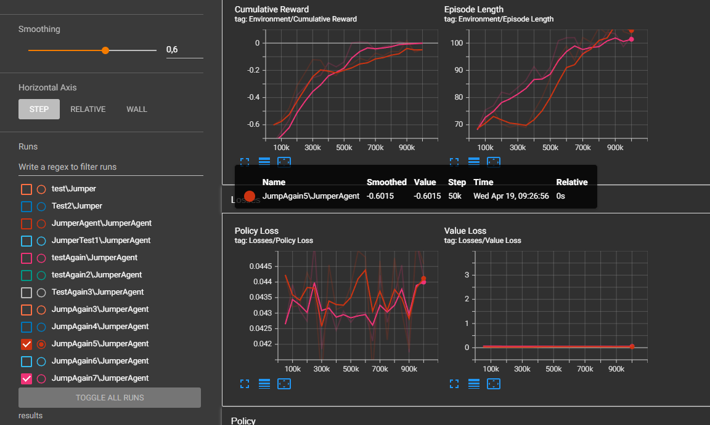